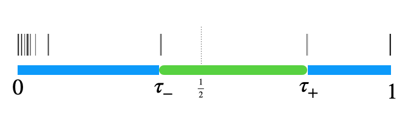

# brownian_zeros
Simulating zeros of Brownian motion
## Splitting an interval terminated by zeros
Example code for recursively simulating the zeros of a standary one-dimensional Brownian bridge with $W_0=W_1=0$, by finding the last zero before the midpoint, and the first zero after.



A sampling formula for the last zero crossing before $1/2$, i.e $W_{\tau_{\textrm{-}}}=0$ with $0 < \tau_{\textrm{-}} < 1/2$ can be found as (derivation [pdf](./brownian_zeros.pdf)),
```math
\tau_{\textrm{-}} = \frac{\sin^2 \left( \frac{\pi}{2} U_1 \right)}{1+\sin^2 \left( \frac{\pi}{2} U_1 \right)}
```
and the first crossing after $1/2$, $W_{\tau_{\textrm{+}}}=0$ with $1/2<\tau_{+}<1$
```math
\tau_{\textrm{+}} = \frac{1-2\tau_{\textrm{-}} + \tau_{\textrm{-}} U_2^2}{1-2\tau_{\textrm{-}}+\;\;\;U_2^2}
```
with $U_1,U_2$ uniformly distributed over $(0,1)$.
