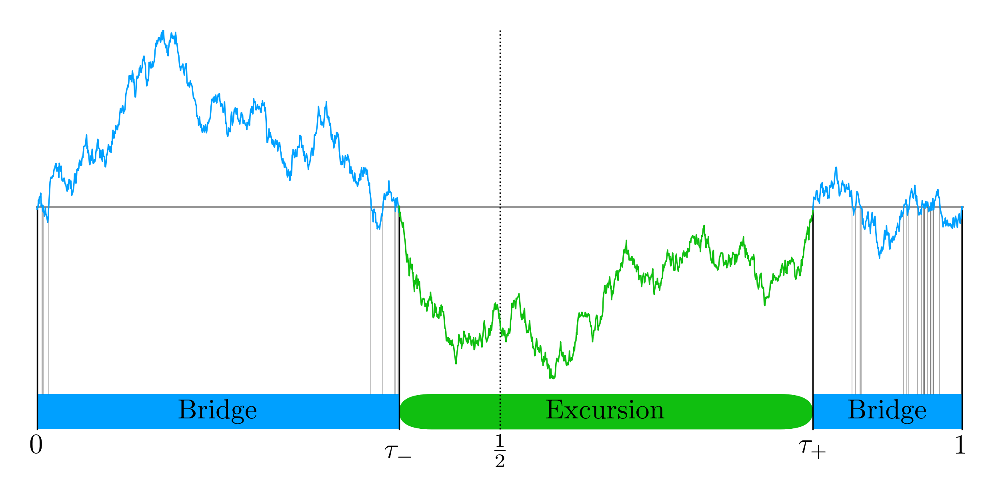

# brownian_zeros
Simulating zeros of Brownian motion
## Splitting a Brownian bridge into a bridge, excursion, bridge
Example code for recursively simulating the zeros of a standary one-dimensional Brownian bridge with $W_0=W_1=0$, by finding the last zero before the midpoint, and the first zero after.



A sampling formula for the first zero crossing after $1/2$, i.e $W_{\tau_{\textrm{+}}}=0$ with $1/2 < \tau_{\textrm{+}} < 1$ can be found as (derivation [pdf](./brownian_zeros.pdf)),
```math
\tau_{\textrm{+}} = \frac{1}{1+\sin^2 \left( \frac{\pi}{2} U_1 \right)}
```
and the last crossing before $1/2$, $W_{\tau_{\textrm{-}}}=0$ with $0<\tau_{-}<1/2$
```math
\tau_{\textrm{-}} = \frac{U_2^2\tau_{\textrm{+}} }{2\tau_{\textrm{+}}+U_2^2-1}
```
with $U_1,U_2$ uniformly distributed over $(0,1)$.

## Further reading
* Generation of sample Brownian trajetories [Aleatory (github)](https://github.com/quantgirluk/aleatory)
* [Brownian bridges (wikipedia)](https://en.m.wikipedia.org/wiki/Brownian_bridge)